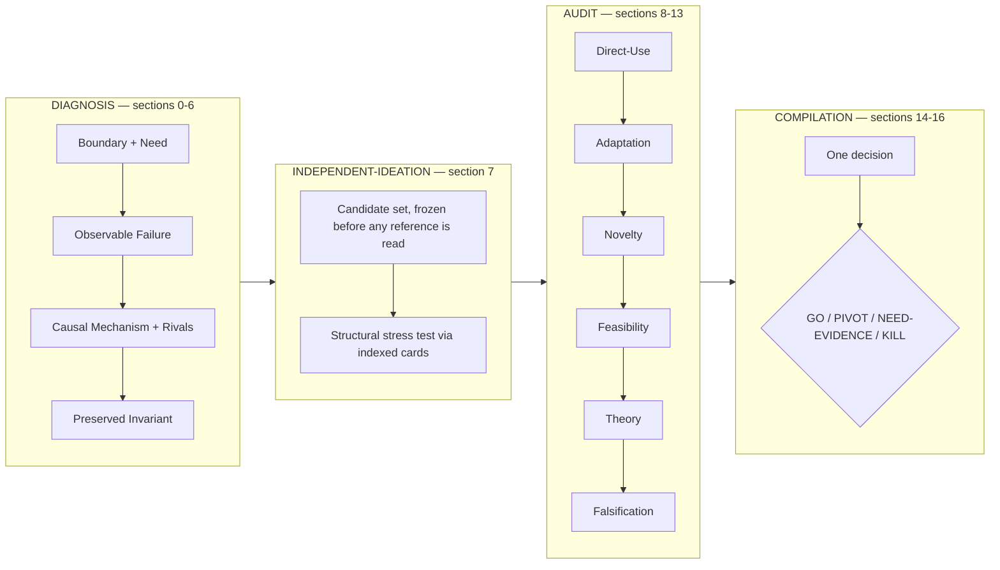

# Time-series-research-skills

[](https://github.com/tylsssss/Time-series-research-skills/actions/workflows/ci.yml)

Two [Agent Skills](https://agentskills.io/specification) that make an agent argue about
a time-series research idea **before** it writes a model, and write the code only after
the argument survives.

| Skill | Job |
|---|---|
| [`time-series-model-ideation`](skills/time-series-model-ideation/) | Compile a research urge into one 17-section **Idea Dossier**: typed claims, evidence levels, twelve stage gates, a novelty audit, a theory boundary, a falsification matrix, and exactly one decision — `GO`, `PIVOT`, `NEED-EVIDENCE`, or `KILL`. |
| [`time-series-code-implementation`](skills/time-series-code-implementation/) | Take the frozen method and build runnable research code: research reference implementations first, freeze a spec, thin end-to-end slice, smoke/overfit/baseline verification, honest report. |

License: Apache-2.0 · Status: `0.1.0`, pre-release · The dossier schema is versioned and
changes only with a migration note.

---

## The failure mode this exists to prevent

Ask a capable model for a research architecture and it will hand you one. Ask it to
justify the architecture and it will hand you a justification. The request below is real
(eval case 1, kept verbatim in the suite, Chinese original):

> **Mode: GENERATE.** I want an ICLR model for long-sequence forecasting on industrial
> sensors. I *feel* instance normalization erases the absolute amplitude changes that
> matter for fault detection, but I have no measurement, ablation, or causal evidence.
> Please design a Diffusion + GNN + LLM-memory architecture, ideally with an amplitude
> recovery module, and explain why it definitely beats existing normalization methods.
> Compute limit: one 24 GB GPU, no future covariates.

Without the skill, the usual outcome is a confident architecture plus a plausible
mechanism story, built on an unmeasured premise.

With the skill, the run ends at `NEED-EVIDENCE`:

| What the skill does with that request | Why |
|---|---|
| Refuses to instantiate a candidate in Section 7 | Candidates require a diagnosed failure, not a preferred module. |
| Records the normalization claim as user-supplied, `E0`, `UNRESOLVED` | A feeling is not a direct measurement, and this dossier separates the two. |
| Names the smallest diagnostic that could change the decision | Prefer the smallest next test over the largest next experiment. |
| Defines at least two rivals, including a plausible artifact or confound | A mechanism is only useful if it predicts differently from its rivals. |
| Emits one decision: `NEED-EVIDENCE`, with `decision_consistency_check: PASS` | No numeric novelty score, no aggregate gate score, no rounding up. |

The illustration above describes the *behavior* the suite asserts, not a transcript from
a specific run — behavioral pass rates depend on your model, and Tier 2 (below) is how
you measure them for yours.

## Quick start

```bash
git clone https://github.com/tylsssss/Time-series-research-skills.git
cd Time-series-research-skills
bash scripts/install.sh --dry-run          # see exactly what would be written
bash scripts/install.sh --target all --scope user
```

`--target all --scope user` installs both skills into `~/.claude/skills/` (Claude Code)
and `~/.agents/skills/` (Codex and compatible clients). An existing installation is
moved aside with a timestamp suffix, never deleted.

Other routes:

| Environment | How |
|---|---|
| Claude Code, plugin marketplace | `/plugin marketplace add tylsssss/Time-series-research-skills` then `/plugin install time-series-research` |
| Claude Code, project-local | `bash scripts/install.sh --target claude --scope project` |
| Codex / `~/.agents/skills` | `bash scripts/install.sh --target agents --scope user` |
| Any chat client, no skills mechanism | `node scripts/build-bundle.mjs` → paste `dist/time-series-model-ideation.bundle.md` as context |
| Reading it yourself | Start at [`skills/time-series-model-ideation/SKILL.md`](skills/time-series-model-ideation/SKILL.md) |

Then ask normally — "审一下我这个 idea", "audit this idea", "根据这个思路写代码".
Both skills have explicit trigger *and* non-trigger conditions in their frontmatter, so
they stay out of the way for general coding and literature-only requests.

## How it works

The ideation skill is not a prompt template; it is a staged argument compiler with
gates. It runs one of four entry modes (`GENERATE`, `AUDIT`, `REPAIR`, `COMPARE`) over
twelve stages grouped into four phases:



Four properties do the actual work:

* **Typed entities with stable IDs.** `CLM-*` holds claims only; every other entity
  (`NEED-*`, `FAIL-*`, `LINK-*`, `RIV-*`, `INV-*`, `CAND-*`, `FIND-*`, `SYS-*`,
  `COMP-*`, `EXP-*`) links back through explicit IDs. Nothing is renumbered once
  something refers to it.
* **Evidence levels `E0`–`E5` and a plan/result separation.** A planned or running
  experiment is `PENDING` and never counts as support. Missing decision-relevant
  evidence is recorded as `UNRESOLVED` with `E0` inside the active section, not hidden
  behind `N/A`.
* **Candidates are frozen before references are read.** Pattern cards are consulted only
  after the candidate set is frozen, at most two public cards and one personal card per
  candidate, and they are used to stress-test structure — never as evidence, never as a
  candidate generator, never as a novelty source.
* **One decision, no averaging.** Every applicable hard gate must be satisfied for
  `GO`; an unresolved gate with nothing unsatisfied yields `NEED-EVIDENCE`; a repairable
  unsatisfied gate yields `PIVOT`; a decisive contradicted gate with no substantive
  repair yields `KILL`. Gates are never summed into a score.

The implementation skill deliberately does **not** re-run that workflow. It freezes a
`SPEC` (task, data, method, evaluation, constraints), researches real reference
implementations before designing, prefers `dependency` over `borrow` over
`reimplement`, records provenance (repo, commit, license) for anything borrowed, and
verifies with smoke → overfit → baseline-sanity → real run before reporting results.

## What's in the box

```text
skills/
  time-series-model-ideation/     SKILL.md (controller), assets/idea-dossier-template.md (schema),
                                  references/ (21 files: diagnosis, novelty, feasibility, theory,
                                  mechanism transfer, 8 public pattern cards, 6 profile slots),
                                  evals/ (12 cases, 99 expectations + 4 fixtures)
  time-series-code-implementation/ SKILL.md (5 phases), assets/ (project + report templates),
                                  references/ (library landscape, research conventions, style slot)
profiles/       default/ and minimal/ — the swappable personal layer (see PERSONALIZE.md)
evals/          dependency-free runner: offline structural grading + opt-in model judging
scripts/        install.sh, use-profile.sh, build-bundle.mjs, lint.mjs
docs/           schema.md (normative format reference), architecture.md, faq.md,
                contributing-a-pattern-card.md, release-checklist.md
```

## Evals

A project whose thesis is "no claim without evidence" cannot ship an untested prompt, so
the ideation skill carries **12 behavioral cases and 99 assertions** (eight expectations
per case, nine for one) covering all four entry modes, adversarial requests, repair and
consistency scenarios, and a stale-upstream-snapshot case:

| # | Mode | What it probes |
|---|---|---|
| 1 | GENERATE | Refuses a fashionable architecture request; returns `NEED-EVIDENCE` |
| 2 | GENERATE | Builds a candidate set from a real diagnosis; freezes before pattern use |
| 3 | AUDIT | Preserves a healthy candidate and refuses ornamental components |
| 4 | AUDIT | Cross-domain mechanism transfer with broken source assumptions |
| 5 | REPAIR | New evidence invalidates an earlier gate; dependent work is invalidated |
| 6 | COMPARE | Audits competing candidates under matched constraints; no premature winner |
| 7 | AUDIT | Resumes from an evaluated upstream snapshot without redoing it |
| 8 | AUDIT | Consistency repair when newly discovered evidence contradicts a passed gate |
| 9 | AUDIT | Rejects a contribution that is only a component, not a mechanism |
| 10 | AUDIT | Novelty audit against a supplied primary-source neighbor |
| 11 | AUDIT | Compiles a final dossier from a validated integration packet |
| 12 | AUDIT | Stops at the Stage-5 boundary; no downstream claims |

```bash
python3 evals/run.py --list                       # inventory
python3 evals/run.py --self-test                  # prove the grader can pass and fail
python3 evals/run.py --grade path/to/dossier.md   # structural grade one dossier
python3 evals/run.py --tier2 --case 1             # generate + judge (needs an API key)
```

* **Tier 1 — structural, offline, CI-safe.** 18 checks — 14 of them fail the run, 4 warn —
  covering section presence and order, lifecycle/body consistency, ID-namespace
  compliance, absence of placeholders, the decision enum and consistency flag, gate-table
  completeness and gate/decision arithmetic, falsification coverage against the G11
  gate, evidence-level range, claim typing, phase
  gating, plan-cited-as-evidence, and cross-section traceability. No key, no network,
  deterministic; `--self-test` proves it both passes a conforming dossier and catches
  every defect in a deliberately broken one.
* **Tier 2 — semantic, opt-in.** Sends a case prompt to a model and judges the eight
  natural-language expectations (Anthropic, OpenAI, or any OpenAI-compatible endpoint).
  Skips cleanly without a key. Results are written to `evals/results/` so a pass rate is
  a file you can review, not a claim in a README.

Tier 1 cannot judge whether an argument is *good* — only whether the dossier respects
its own contract. That limitation is documented in `evals/README.md` rather than papered
over.

## Your own research taste is a swappable input

The skills carry a **personal layer**: six `personal-*.md` slots — your research priors,
a routing index, three precedent cards, and the code style every generated line must
follow. It is why the output can be opinionated instead of generic.

**What ships is neutral.** `profiles/default/` is an empty skeleton: the same six files,
no preferences, no precedent content, and a note in each about what belongs there. No
file in this repository describes anyone's unpublished project.

**Keep your own layer local.** `profiles/private/` is git-ignored, which is where your
real stance belongs — a precedent card names the failure, mechanism, and invariant of a
project that may still be under review, and that is a disclosure rather than a preference:

```bash
mkdir -p profiles/private && cp profiles/default/*.md profiles/private/
$EDITOR profiles/private/*.md           # your priors and cards
bash scripts/use-profile.sh private     # apply it (previous content backed up)
bash scripts/use-profile.sh --list      # profiles and the active one
bash scripts/use-profile.sh default     # restore the shipped neutral default
```

A profile must replace all six slots; half-swapped layers contradict themselves, and the
script refuses to apply an incomplete one. `scripts/lint.mjs` warns when the live slots
differ from `profiles/default` — that warning is the tripwire that stops a private
profile from being committed by accident. Full instructions, including what to write and
why the three card filenames are fixed, are in [`PERSONALIZE.md`](PERSONALIZE.md).

## Context budget

The skill reads references **per stage**, never all at startup. Approximate sizes
measured from this checkout (bytes / 4):

| Tier | Files | Size | ≈ tokens |
|---|---|---|---|
| Core: controller + dossier schema | `SKILL.md`, `assets/idea-dossier-template.md` | 40.5 KB | ~10k |
| + Diagnosis stage | `problem-diagnosis.md`, `personal-research-priors.md` | +14.6 KB | ~4k |
| + Stage-5 routing | 2 indexes + up to 3 cards | +13.3 KB | ~3k |
| + Audit stages | novelty, feasibility, theory, and mechanism transfer (the last only for a cross-domain candidate) | +64.4 KB | ~16k |
| Typical full ideation session | cumulative | 133 KB | ~34k |
| Whole skill directory (incl. eval suite) | 28 files | 209 KB | ~53k |

The router caps card loading at two public cards and one personal card per candidate, so
the tier table is a ceiling for a single candidate, not a sum of every file: the full
`references/` set is 103 KB even though a run never loads all of it.

If that is too much for your context, build the flattened bundle and load it selectively,
or trim the profile slots to the sections you actually use.

## What this does not do

* It does **not** prove an idea is novel. It bounds a search, records what was compared,
  and refuses to treat non-discovery as novelty. Passing the audit means "not yet
  contradicted within the recorded scope".
* It does **not** replace experiments. It tells you which experiment would change your
  decision, and it will not let a planned experiment support a claim.
* It does **not** write your paper, produce publication figures, or format references.
* It does **not** make a bad idea good. `KILL` is a successful outcome.
* It is **not** validated on a public leaderboard. The suite is behavioral and small;
  the Tier-2 pass rate depends on your model.
* It is **not** for general coding or literature-only summaries — both skills declare
  that boundary in their frontmatter.

## Roadmap

* Publish Tier-2 pass rates per model in `evals/results/` (a real table, regenerated).
* `docs/self-audit.md`: this repository's own pipeline run against itself.
* Pattern cards for streaming/drift regimes and probabilistic objectives.
* A migration tool for dossiers written against an older schema version.
* A third skill for reviewer-style manuscript critique, if it can be given its own gates.

## Contributing

Behavior changes must ship with an eval expectation; the dossier schema is frozen except
by explicit migration; reference paths must resolve (CI enforces it). See
[`CONTRIBUTING.md`](CONTRIBUTING.md) and
[`docs/contributing-a-pattern-card.md`](docs/contributing-a-pattern-card.md).

Behavioral failures — a gate passed with unresolved evidence, a numeric novelty score, a
plan cited as support — are the most valuable bug reports. Use the *Behavioral failure*
issue template.

## Citation

```bibtex
@software{time_series_research_skills,
  title  = {Time-series-research-skills: Agent Skills for time-series research ideation and implementation},
  author = {tylsssss},
  year   = {2026},
  version = {0.1.0},
  license = {Apache-2.0},
  url    = {https://github.com/tylsssss/Time-series-research-skills}
}
```

See [`CITATION.cff`](CITATION.cff). Licensed under
[Apache-2.0](LICENSE); see [`NOTICE`](NOTICE) for what this repository does and does not
bundle. This project is not affiliated with, endorsed by, or sponsored by Anthropic or
OpenAI; vendor names describe compatibility only.
