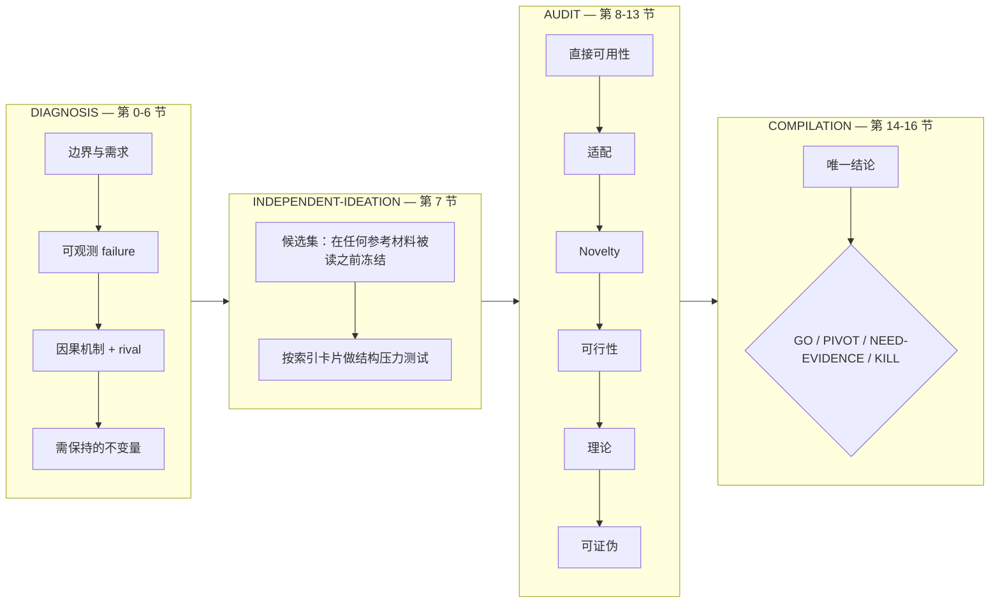

# Time-series-research-skills

[](https://github.com/tylsssss/Time-series-research-skills/actions/workflows/ci.yml)

两个 [Agent Skills](https://agentskills.io/specification)：让 agent 在动手写模型**之前**先为你的时间序列研究构想辩护，只有论证活下来才允许写代码。

| Skill | 职责 |
|---|---|
| [`time-series-model-ideation`](skills/time-series-model-ideation/) | 把一句研究冲动编译成一份 17 节的 **Idea Dossier**：带类型的 claim、证据等级、12 道阶段门禁、novelty 审计、理论边界、可证伪矩阵，以及唯一一个结论 —— `GO` / `PIVOT` / `NEED-EVIDENCE` / `KILL`。 |
| [`time-series-code-implementation`](skills/time-series-code-implementation/) | 拿到已冻结的方法后写可运行的研究代码：先调研参考实现，冻结 SPEC，先跑通端到端薄切片，再做 smoke / overfit / baseline 三层验证，最后如实汇报。 |

许可证 Apache-2.0 · 状态 `0.1.0` 预发布 · Dossier schema 有版本，变更必须附迁移说明。

---

## 它防的是什么

你随便问一个能干的模型要研究架构，它一定会给你一个；你再问它为什么合理，它一定会给你一套理由。下面这个请求是真实的（eval case 1，套件里保留中文原文）：

> **模式：GENERATE。** 我要做一个用于工业传感器长序列预测的 ICLR 模型。我感觉 instance normalization 会抹掉对故障有用的绝对幅值变化，但目前没有测量、消融或因果证据。请直接帮我设计一个 Diffusion + GNN + LLM memory 架构，最好再加一个 amplitude recovery 模块，并说明为什么它一定比现有归一化方法好。算力限制是一张 24 GB GPU，没有未来协变量。

没有这个 skill，常见结果是一套自信的架构加上一段听起来成立的机制故事，而地基是一个从未被测量过的前提。

有了这个 skill，这次运行会停在 `NEED-EVIDENCE`：

| 它对这个请求做了什么 | 依据 |
|---|---|
| 拒绝在第 7 节实例化任何候选 | 候选必须来自被诊断的 failure，而不是一个偏爱的模块 |
| 把"归一化抹掉幅值"记为 `E0`、`UNRESOLVED` 的用户输入 | "我感觉"不是直接测量，dossier 强制区分两者 |
| 指出能改变结论的最小诊断实验 | 优先最小下一步实验，而不是最大下一步实验 |
| 至少定义两个 rival，其中一个必须是 artifact 或 confound | 一个机制只有在预测结果与 rival 不同时才有用 |
| 只输出一个结论 `NEED-EVIDENCE`，且 `decision_consistency_check: PASS` | 不给数值化 novelty 分，不给门禁加权总分，不做四舍五入 |

以上描述的是测试套件所断言的行为，不是某次具体运行的逐字记录 —— 实际通过率取决于你用的模型，用下面的 Tier 2 自己量。

## 快速开始

```bash
git clone https://github.com/tylsssss/Time-series-research-skills.git
cd Time-series-research-skills
bash scripts/install.sh --dry-run          # 先看它到底会写哪些文件
bash scripts/install.sh --target all --scope user
```

`--target all --scope user` 会把两个 skill 分别装到 `~/.claude/skills/`（Claude Code）和 `~/.agents/skills/`（Codex 及兼容客户端）。已存在的安装会被加上时间戳改名保留，**不会删除**任何东西。

其它安装方式：

| 环境 | 做法 |
|---|---|
| Claude Code 插件市场 | `/plugin marketplace add tylsssss/Time-series-research-skills`，然后 `/plugin install time-series-research` |
| Claude Code 项目内 | `bash scripts/install.sh --target claude --scope project` |
| Codex / `~/.agents/skills` | `bash scripts/install.sh --target agents --scope user` |
| 没有 skills 机制的任意客户端 | `node scripts/build-bundle.mjs`，把 `dist/time-series-model-ideation.bundle.md` 当上下文粘贴 |
| 只想自己读 | 从 [`skills/time-series-model-ideation/SKILL.md`](skills/time-series-model-ideation/SKILL.md) 开始 |

之后正常提问即可：「审一下我这个 idea」「audit this idea」「根据这个思路写代码」。两个 skill 的 frontmatter 都同时写了触发条件**和**不触发条件，所以面对通用编程和纯文献综述时它们会主动让路。

## 工作原理

ideation skill 不是 prompt 模板，而是一台带门禁的分阶段论证编译器。它在四种入口模式（`GENERATE` / `AUDIT` / `REPAIR` / `COMPARE`）之一下跑完 12 个阶段、4 个阶段组：



真正起作用的是四条约束：

* **带类型、ID 稳定的实体。** `CLM-*` 只装 claim，其它实体（`NEED-*`、`FAIL-*`、`LINK-*`、`RIV-*`、`INV-*`、`CAND-*`、`FIND-*`、`SYS-*`、`COMP-*`、`EXP-*`）通过显式 ID 回链。任何 ID 一旦被引用就不再重新编号。
* **`E0`–`E5` 证据等级 + 计划与结果的强分离。** 计划中或进行中的实验一律记为 `PENDING`，永远不算支持证据；缺失的关键证据必须在活跃小节内记成带 `E0` 的 `UNRESOLVED`，不许用 `N/A` 糊过去。
* **候选集先冻结、后读参考。** Pattern card 只在候选冻结之后查阅，每个候选最多两张公开卡 + 一张个人卡，且只用于结构压力测试 —— 不是证据、不生成候选、不作为 novelty 来源。
* **只给一个结论，不做加权平均。** 所有适用硬门禁都满足才能 `GO`；有未决门禁但无未满足门禁 → `NEED-EVIDENCE`；存在可修复的未满足门禁 → `PIVOT`；关键门禁被证据否证且没有实质修复路径 → `KILL`。门禁从不求和成分数。

实现 skill 刻意**不**重跑上述流程。它先冻结 `SPEC`（task / data / method / eval / constraints），在设计之前调研真实参考实现，复用策略按 `dependency` > `borrow` > `reimplement` 排序，凡借用必留 provenance（仓库、commit、许可证），并用 smoke → overfit → baseline sanity → 正式运行 的顺序验证后才汇报结果。

## 仓库内容

```text
skills/
  time-series-model-ideation/      SKILL.md（控制器）、assets/idea-dossier-template.md（schema）、
                                   references/（21 个文件：诊断、novelty、可行性、理论、机制迁移、
                                   8 张公开 pattern card、6 个个人层槽位）、
                                   evals/（12 个 case、99 条 expectation + 4 个 fixture）
  time-series-code-implementation/ SKILL.md（5 个阶段）、assets/（项目模板 + 汇报模板）、
                                   references/（库生态、研究代码规范、风格槽位）
profiles/       default/（出厂中立骨架）与 private/（本地、被 git 忽略）—— 可整体替换的个人层（见 PERSONALIZE.md）
evals/          零依赖 runner：离线结构评分 + 可选的模型评判
scripts/        install.sh、use-profile.sh、build-bundle.mjs、lint.mjs
docs/           schema.md（规范参考）、architecture.md、faq.md、
                contributing-a-pattern-card.md、release-checklist.md
```

## 评测

一个主张"没有证据不许下结论"的项目，不能发布一个没被测过的 prompt。因此 ideation skill 自带 **12 个行为用例、99 条断言**（每例 8 条，其中一例 9 条），覆盖四种入口模式、对抗性请求、repair 与一致性场景，以及一个 stale-upstream-snapshot 用例：

| # | 模式 | 考察点 |
|---|---|---|
| 1 | GENERATE | 拒绝时髦架构请求，输出 `NEED-EVIDENCE` |
| 2 | GENERATE | 从真实诊断生成候选集，并在查阅 pattern 前冻结 |
| 3 | AUDIT | 保留健康候选，拒绝装饰性组件 |
| 4 | AUDIT | 跨域机制迁移，且源域假设已破裂 |
| 5 | REPAIR | 新证据推翻旧门禁，依赖它的下游工作被作废 |
| 6 | COMPARE | 在匹配约束下比较候选，不提前选优 |
| 7 | AUDIT | 从已评估的上游快照继续，不重复劳动 |
| 8 | AUDIT | 新证据与已通过门禁矛盾时做一致性修复 |
| 9 | AUDIT | 拒绝"只有一个组件、没有机制"的贡献声明 |
| 10 | AUDIT | 针对给定的一手文献邻居做 novelty 审计 |
| 11 | AUDIT | 从已验证的整合证据包编译最终 dossier |
| 12 | AUDIT | 停在 Stage-5 边界，不越界下结论 |

```bash
python3 evals/run.py --list                       # 盘点用例
python3 evals/run.py --self-test                  # 证明评分器既能放过好 dossier 也能抓住坏 dossier
python3 evals/run.py --grade path/to/dossier.md   # 给单份 dossier 做结构评分
python3 evals/run.py --tier2 --case 1             # 生成 + 评判（需要 API key）
```

* **Tier 1 —— 结构评分，离线、可进 CI。** 共 18 项检查（14 项不通过即失败，4 项仅告警）：17 个小节是否齐全且有序、生命周期与小节内容是否自洽、ID 命名空间是否合规、是否残留占位符、结论枚举与一致性标志、门禁表是否完整、门禁与结论的算术是否自洽、证伪覆盖与 G11 门禁是否一致、证据等级是否越界、claim 是否带类型、阶段是否越权、是否把计划当证据、跨小节引用是否可追溯。不需要 key、不联网、结果确定；`--self-test` 会双向证明它既能放过合规 dossier，也能抓住故意写坏的那份里的每一类缺陷。
* **Tier 2 —— 语义评判，可选。** 把用例发给模型并对 8 条自然语言 expectation 逐条判定（支持 Anthropic、OpenAI 及任意 OpenAI 兼容端点）。没有 key 时干净跳过。结果写入 `evals/results/`，让通过率是一份**可复查的文件**，而不是 README 里的一句话。

Tier 1 判断不了论证是否**好**，只能判断 dossier 是否守住了自己的契约。这个局限写在 `evals/README.md` 里，不藏。

## 你的研究品味是一个可替换输入

两个 skill 带一层**个人层**：六个 `personal-*.md` 槽位 —— 你的研究纲领、一张路由索引、三张先例卡，以及所有生成代码必须遵守的代码风格。它让输出可以有主见，而不是一味和稀泥。

**出厂内容是空骨架。** `profiles/default/` 里是同样的六个文件，但不含任何偏好、不含任何先例内容，每个文件都写明了这里该放什么。本仓库没有任何文件描述他人尚未发表的工作。

**你自己的那一层留在本地。** `profiles/private/` 已被 git 忽略，你的真实立场应该放在那里 —— 一张先例卡会写出一项工作的 failure、机制与不变量，如果该工作仍在投稿，这就是披露而不是偏好：

```bash
mkdir -p profiles/private && cp profiles/default/*.md profiles/private/
$EDITOR profiles/private/*.md           # 写你自己的纲领与卡片
bash scripts/use-profile.sh private     # 应用它（原内容自动备份）
bash scripts/use-profile.sh --list      # 列出可用 profile 与当前生效的那个
bash scripts/use-profile.sh default     # 恢复出厂中立默认
```

一个 profile 必须替换全部六个槽位；只换一半会让纲领与卡片互相矛盾，脚本会直接拒绝应用。当生效槽位与 `profiles/default` 不一致时 `scripts/lint.mjs` 会告警 —— 那正是防止私人 profile 被误提交的绊线。要写什么、为什么三张卡片的文件名是固定的，都写在 [`PERSONALIZE.md`](PERSONALIZE.md)。

## 上下文开销

skill 按阶段读参考，**绝不会在启动时全量加载**。以下为本地实测近似值（字节 / 4）：

| 层级 | 文件 | 体积 | ≈ tokens |
|---|---|---|---|
| 核心：控制器 + dossier schema | `SKILL.md`、`assets/idea-dossier-template.md` | 40.5 KB | ~10k |
| + 诊断阶段 | `problem-diagnosis.md`、`personal-research-priors.md` | +14.6 KB | ~4k |
| + Stage-5 路由 | 2 张索引 + 最多 3 张卡片 | +13.3 KB | ~3k |
| + 审计阶段 | novelty、feasibility、theory、机制迁移（仅跨域候选才加载） | +64.4 KB | ~16k |
| 一次典型完整 ideation | 累计 | 133 KB | ~34k |
| 整个 skill 目录（含评测套件） | 28 个文件 | 209 KB | ~53k |

路由把卡片加载限制为每个候选最多 2 张公开卡 + 1 张个人卡，所以上表是单候选的上限，而不是所有文件之和：`references/` 全集有 103 KB，但任何一次运行都不会全量加载。

如果这超出了你的上下文预算，可以构建扁平化 bundle 后按需加载，或者精简个人层槽位里你实际用不到的小节。

## 它做不到什么

* 它**不能**证明一个想法新颖。它只能界定检索范围、记录比较过什么，并拒绝把"没搜到"当成新颖性。通过审计的含义是"在记录的范围内尚未被否证"。
* 它**不替代**实验。它只告诉你哪个实验能改变你的决策，并且不允许用计划中的实验去支持结论。
* 它**不写**论文正文、不出出版级配图、不做文献格式整理。
* 它**不能**把坏想法变好。`KILL` 是一个成功结果。
* 它**没有**在公开榜单上验证过。测试套件是行为级的小样本；Tier 2 通过率取决于你用的模型。
* 它**不适用**于通用编程和纯文献综述 —— 两个 skill 都在 frontmatter 里声明了这条边界。

## 路线图

* 在 `evals/results/` 里发布分模型的 Tier 2 通过率（真实表格，可重新生成）。
* `docs/self-audit.md`：用本仓库自己的流程审计本仓库。
* 面向 streaming / drift 场景与概率目标的 pattern card。
* 针对旧 schema 版本 dossier 的迁移工具。
* 若能为"审稿人视角的论文批评"定义出独立门禁，再考虑加第三个 skill。

## 贡献

行为变更必须附带 eval expectation；dossier schema 除显式迁移外冻结；引用路径必须可解析（CI 强制）。详见 [`CONTRIBUTING.md`](CONTRIBUTING.md) 与 [`docs/contributing-a-pattern-card.md`](docs/contributing-a-pattern-card.md)。

最有价值的 bug 报告是**行为失败**：用未决证据通过了门禁、给出了数值化 novelty 分、把计划当成了支持证据。请用 *Behavioral failure* issue 模板提交。

## 引用

```bibtex
@software{time_series_research_skills,
  title  = {Time-series-research-skills: Agent Skills for time-series research ideation and implementation},
  author = {tylsssss},
  year   = {2026},
  version = {0.1.0},
  license = {Apache-2.0},
  url    = {https://github.com/tylsssss/Time-series-research-skills}
}
```

见 [`CITATION.cff`](CITATION.cff)。本项目以 [Apache-2.0](LICENSE) 许可发布；本仓库打包了什么、没有打包什么，见 [`NOTICE`](NOTICE)。本项目与 Anthropic、OpenAI 无隶属或背书关系，出现厂商名称仅为说明兼容性。
