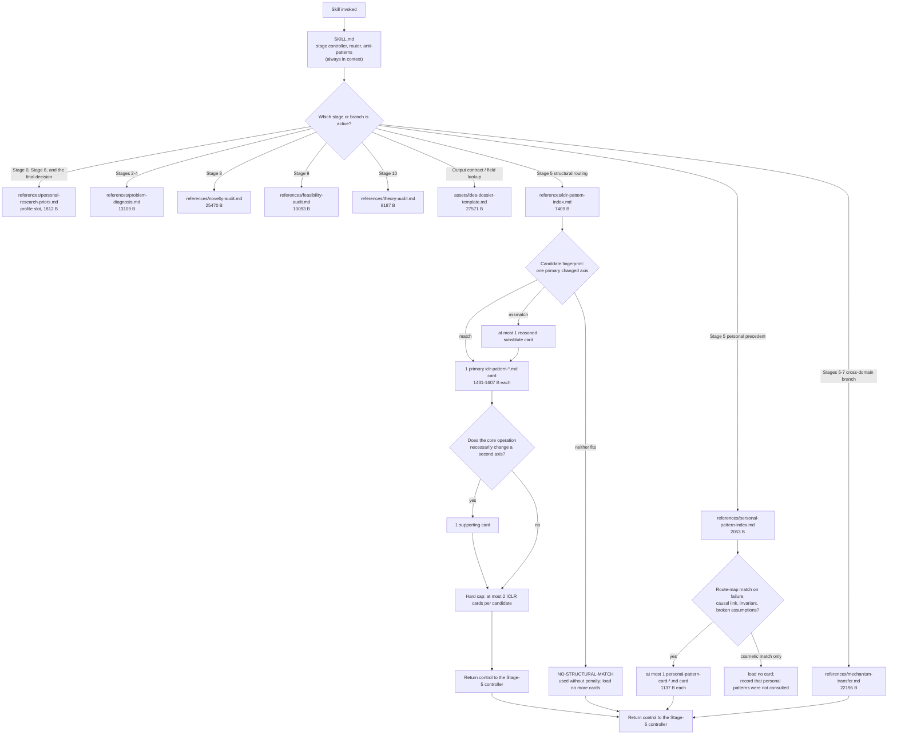

# Architecture

How the two skills are structured, what gets loaded when, and what that costs in
context.

All sizes in this document were measured with `wc -c` / `os.path.getsize` on the working
tree at **2026-09-27 14:04:36 CST** (the dossier schema 1.1.0 revision with the neutral
personal layer). The repository was being
edited concurrently while this document was written, so re-measure before quoting a
number elsewhere. The exact commands are in
[Measurement provenance](#measurement-provenance).

The authoritative files are:

- `skills/time-series-model-ideation/SKILL.md` — stage controller, entry modes, phases,
  reference router, gate-result-to-decision table, anti-patterns.
- `skills/time-series-model-ideation/assets/idea-dossier-template.md` — sole authority
  for sections, fields, enums, ID namespaces, lifecycle values, and field order.
- `skills/time-series-code-implementation/SKILL.md` — the downstream implementation
  workflow.

## 1. The argument chain, its phases, and its gates

`SKILL.md` defines one traceable chain (`SKILL.md` lines 13–24). The chain has twelve
elements; eleven of them are gated one-for-one by `G1`–`G11`, with `G0` gating the
research boundary that precedes the chain and the twelfth element (the decision)
compiled at Stage 12 from the whole gate roster.

```mermaid
flowchart TD
    subgraph DIAG["DIAGNOSIS - Sections 0-6 (Stages 0-4)"]
        direction TB
        B["Research boundary<br/>Sections 0-1"]
        G0{{"G0 Boundary"}}
        N["1 Need (solution-independent)<br/>Section 2"]
        G1{{"G1 Need"}}
        F["2 Observable Failure<br/>Section 4 (with the claim ledger, Section 3)"]
        G2{{"G2 Failure"}}
        C["3 Causal Mechanism<br/>Section 5 (LINK-* and RIV-*)"]
        G3{{"G3 Causality"}}
        I["4 Preserved Invariant<br/>Section 6"]
        G4{{"G4 Invariant"}}
    end

    subgraph IND["INDEPENDENT-IDEATION - Section 7 (Stage 5)"]
        CAND["5 Candidate Mechanisms<br/>Section 7, 7.1, 7.2<br/>freeze before any pattern read"]
        G5{{"G5 Candidates"}}
    end

    subgraph AUD["AUDIT - Sections 8-13 (Stages 6-11)"]
        direction TB
        DU["6 Direct-Use Assessment<br/>Section 8 (FIND-*)"]
        G6{{"G6 Direct Use"}}
        AD["7 Time-Series Adaptation<br/>Section 9 (SYS-*, COMP-*)"]
        G7{{"G7 Adaptation"}}
        NO["8 Novelty Audit<br/>Section 10"]
        G8{{"G8 Novelty"}}
        FE["9 Feasibility<br/>Section 11"]
        G9{{"G9 Feasibility"}}
        TH["10 Theory Boundary<br/>Section 12"]
        G10{{"G10 Theory"}}
        FA["11 Falsification<br/>Section 13 (EXP-*)"]
        G11{{"G11 Falsification"}}
    end

    subgraph COMP["COMPILATION - Sections 14-16 (Stage 12)"]
        DEC["12 Decision: GO / PIVOT / NEED-EVIDENCE / KILL<br/>Sections 14-16, DERIVED-ONLY, no gate of its own"]
    end

    B --> G0 --> N --> G1 --> F --> G2 --> C --> G3 --> I --> G4 --> CAND --> G5 --> DU --> G6 --> AD --> G7 --> NO --> G8 --> FE --> G9 --> TH --> G10 --> FA --> G11 --> DEC
```



Reading notes:

- The phase bands (subgraphs) come from the template's section ranges
  (`idea-dossier-template.md` lines 15–19 = `SKILL.md` lines 67–72). The stage and gate
  alignment inside each band follows `SKILL.md` line 74, which states that stages are
  numbered 0–12, that sections are numbered 0–16, that the two are offset, and that gates
  align with stages rather than sections; the gate roster itself is the template's
  (`idea-dossier-template.md` lines 433–444). `docs/schema.md` → Known inconsistencies,
  item 1 records that this offset was previously unstated and is now documented.
- Section 3 (Typed Claim Ledger) is written across Stages 2–4 rather than at a single
  stage: "Update Section 3 with diagnosis-related `CLM-*` records"
  (`references/problem-diagnosis.md` line 41).
- Diagnostic `EXP-*` rows are created in Section 13 during Stages 2–4, before candidates
  exist (`references/problem-diagnosis.md` lines 45, 134–135).
- `COMPILATION` can be entered early: "Enter `COMPILATION` as soon as current evidence
  supports an early `NEED-EVIDENCE` or `PIVOT`; leave unevaluated downstream gates
  deferred" (`SKILL.md` line 76). The diagram shows the full-depth path, not the only
  path.

## 2. Progressive reference loading

The rule is explicit: "Do not load all references or all cards at startup."
(`SKILL.md` line 207). The router has one always-present file, nine stage-keyed loads,
and two hard caps on card fan-out.



Hard limits, quoted:

- ICLR cards: "The ICLR index may route to at most two of these directly linked cards
  per research candidate" (`SKILL.md` lines 194–203); "Stop after at most two loaded
  cards per candidate" (`references/iclr-pattern-index.md` line 82).
- Personal cards: "The personal index may route to at most one card per research
  candidate, selected from the route map in `references/personal-pattern-index.md`"
  (`SKILL.md` line 205); "Load at most one card per research candidate"
  (`references/personal-pattern-index.md` line 8).
- No card at all when the match is cosmetic: "load none when only terminology or module
  shape matches" (`SKILL.md` line 114); "Load no card when only terminology, module
  type, diagram shape, or application area matches"
  (`references/personal-pattern-index.md` line 10).
- `NO-STRUCTURAL-MATCH` is a valid outcome: "Use `NO-STRUCTURAL-MATCH` without penalty
  when no catalogued pattern fits" (`SKILL.md` line 117); "Catalog absence is not
  evidence for or against the candidate" (`references/iclr-pattern-index.md` line 91).
- Missing file: "If a required file is unavailable, record the missing dependency and do
  not invent its contents" (`SKILL.md` line 207).

## 3. The two-skill pipeline

The Idea Dossier is the interface artifact. The ideation skill stops when the dossier is
complete; the implementation skill starts from a frozen method, which may arrive as that
dossier or as a verbal description.

```mermaid
flowchart LR
    U["User: research urge, or a supplied idea<br/>(possibly with evidence)"] --> SC

    subgraph IDE["time-series-model-ideation"]
        direction TB
        SC["Stage controller<br/>entry mode: GENERATE / AUDIT / REPAIR / COMPARE"] --> PH["Phases in order<br/>DIAGNOSIS -> INDEPENDENT-IDEATION -> AUDIT -> COMPILATION"]
        PH --> GATES["Gates G0-G11 in Section 15<br/>EVALUATED/DEFERRED, SATISFIED/UNRESOLVED/UNSATISFIED"]
        GATES --> S16["Section 16: exactly one decision"]
    end

    S16 --> DOS["Idea Dossier (Sections 0-16)<br/>interface artifact: NEED-*, FAIL-*, LINK-*,<br/>INV-*, CAND-*, SYS-*, COMP-*, CLM-*, EXP-*"]
    DOS --> D{"Decision"}
    D -->|"KILL"| STOP["Stop: no substantive research direction"]
    D -->|"NEED-EVIDENCE / PIVOT"| NEXT["Smallest next action + earliest return stage"] --> SC
    D -->|"GO"| HC1["Human decision point:<br/>accept the dossier and treat the method as frozen"]

    HC1 --> P0
    V["Verbal idea (the common case)"] --> P0

    subgraph IMP["time-series-code-implementation"]
        direction TB
        P0["Phase 0: extract and freeze the method spec"] --> SPEC["Emit SPEC block"]
        SPEC --> HC2["Human decision point:<br/>explicit confirmation before coding<br/>(required by the skill)"]
        HC2 --> P1["Phases 1-5: reference research, design,<br/>implement thin slice, verify, deliver"]
    end

    P1 --> OUT["Runnable code + verification status<br/>+ provenance + honest results report<br/>(no paper prose, no final figures)"]
```



Human confirmation points, quoted and bounded:

- **Implementation, before any code**: "Emit a frozen SPEC block and get explicit
  confirmation before coding" (`skills/time-series-code-implementation/SKILL.md` line
  45); "Do not write code before the method is frozen and confirmed" (same file, line
  117).
- **Implementation, spec extraction**: clarifying questions are batched in one message,
  ordered by what changes the architecture (same file, line 43).
- **The handoff itself**: the ideation skill stops after the dossier — "Stop after the
  dossier without code, polished paper prose, or final figures" (`SKILL.md` line 217) —
  and the implementation skill declares itself the downstream partner of that skill
  (`skills/time-series-code-implementation/SKILL.md` line 10).
- **The ideation skill states no human-approval gate.** Its decision is derived from
  gate states, not from user sign-off: Section 16 requires
  `decision_consistency_check: PASS` (`idea-dossier-template.md` line 477), and `GO` is "eligible" only
  when every gate is evaluated and satisfied and novelty is `PASS` (`SKILL.md` lines
  169–174). Treating the dossier as a proposal for a human to accept is a workflow
  choice, not a rule the skill states.

## 4. Stage-to-reference map

From `SKILL.md`'s router (lines 182–192), the inline stage text, and the card limits
(lines 194–210):

| Stage or phase | Loads | Size (B) | Notes |
|---|---|---|---|
| Always (Core) | `SKILL.md` | 13860 | The skill body: controller, router, contract, anti-patterns |
| Output contract / field lookup (Core) | `assets/idea-dossier-template.md` | 27571 | Sole authority for sections, fields, enums, ID namespaces, lifecycle, order |
| Stage 0, Stage 8, and the final decision | `references/personal-research-priors.md` | 1812 | Profile slot; read at the boundary, as a novelty-audit input, and before compiling the decision |
| Stages 2–4 | `references/problem-diagnosis.md` | 13109 | Causal-diagnosis protocol; updates Sections 3–6, 13, and G2–G4 |
| Stage 5 structural routing | `references/iclr-pattern-index.md` | 7409 | Entry contract, fingerprint, routing table, bounded loading, three-principle audit |
| Stage 5 structural cards | 1–2 of `references/iclr-pattern-[a-h]-*.md` | 1431–3214 | At most two per research candidate; primary + optional supporting card |
| Stage 5 personal precedence routing | `references/personal-pattern-index.md` | 2063 | Route map; "load no card" is a valid outcome |
| Stage 5 personal card | at most 1 of `references/personal-pattern-card-*.md` | 1137 | At most one per candidate; profile slot, empty as shipped |
| Stage 5–7 cross-domain branch | `references/mechanism-transfer.md` | 22196 | Only for a cross-domain candidate or an explicit transfer audit |
| Stage 8 | `references/novelty-audit.md` | 25470 | Bounded contribution-delta audit; updates Section 10 and G8 |
| Stage 9 | `references/feasibility-audit.md` | 10093 | Structural executability and testability; updates Section 11 and G9 |
| Stage 10 | `references/theory-audit.md` | 8187 | Per-claim theory audit; updates Section 12 and G10 |
| Stage 11 | — | — | No stage-specific reference; the falsification matrix itself is the protocol |
| Stage 12 | `references/personal-research-priors.md` (re-read) | 1812 | Also loaded at Stage 0 and Stage 8; the decision is compiled from existing IDs only |
| Implementation Phase 1 | `references/library-landscape.md` | 6699 | Task-to-library map |
| Implementation Phases 2–4 | `references/personal-code-style.md` | 1914 | Profile slot; authoritative over generic conventions |
| Implementation Phases 2–4 | `references/research-code-conventions.md` | 6005 | Seeds, config, logging, leakage-safe splits, checkpoints |
| Implementation Phase 3 | `assets/project-template.md` | 15799 | Starter files and file-level style |
| Implementation Phase 5 | `assets/report-template.md` | 2079 | Sole authority for the report's headings and order |

Pattern cards referenced by the two indexes:

| Card | Bytes |
|---|---|
| `references/iclr-pattern-a-mechanism.md` | 1542 |
| `references/iclr-pattern-b-modeled-object.md` | 1471 |
| `references/iclr-pattern-c-granularity.md` | 1524 |
| `references/iclr-pattern-d-responsibility.md` | 1475 |
| `references/iclr-pattern-e-information-flow.md` | 1445 |
| `references/iclr-pattern-f-invariant.md` | 1431 |
| `references/iclr-pattern-g-objective-computation.md` | 1444 |
| `references/iclr-pattern-h-operational-framework.md` | 1607 |
| `references/personal-pattern-card-a.md` | 1137 |
| `references/personal-pattern-card-b.md` | 1137 |
| `references/personal-pattern-card-c.md` | 1137 |

The six `personal-*.md` files live in the profile layer. What this document measures is
the **shipped neutral skeleton**: `profiles/default/` is "a neutral skeleton: the same six
files, no preferences, no precedent content" (`PERSONALIZE.md` lines 24–26), so the
priors slot is 1812 B, the index holds no route rows, and each card slot is an empty
1137 B template. The skeleton's copies under `profiles/default/` were verified
byte-identical to the live slots at measurement time (`cmp` reported no differences for
all six slots), which satisfies the sync rule in `profiles/README.md` lines 46–52.

**A user's own profile is arbitrary in size.** The numbers above describe the shipped
skeleton, not a typical personal layer: a real priors file, a populated route map, and
three substantive cards can be several times larger, and none of the tier subtotals below
predict that. The canonical way to keep such a layer is the git-ignored `profiles/private/`
(`PERSONALIZE.md` lines 29–30); do not treat the skeleton's byte counts as a budget for
your own files.

## 5. Context budget

Token counts are **approximations** computed as `bytes / 4`. They are a planning aid,
not a measurement: the real ratio depends on the tokenizer, on how much of each file the
agent actually reads, and on how much of the loaded content survives into the working
context. Byte counts are exact as of the measurement timestamp.

### Tier: Core — always present

| File | Bytes | ~Tokens (bytes/4) |
|---|---|---|
| `skills/time-series-model-ideation/SKILL.md` | 13860 | 3465 |
| `skills/time-series-model-ideation/assets/idea-dossier-template.md` | 27571 | 6893 |
| **Tier subtotal** | **41431** | **10358** |

### Tier: Diagnosis — Stages 0–4

| File | Bytes | ~Tokens (bytes/4) |
|---|---|---|
| `references/personal-research-priors.md` (profile slot, shipped skeleton) | 1812 | 453 |
| `references/problem-diagnosis.md` | 13109 | 3277 |
| **Tier subtotal** | **14921** | **3730** |

### Tier: Stage-5 routing — candidate freeze, then bounded pattern inspection

| File | Bytes | ~Tokens (bytes/4) |
|---|---|---|
| `references/iclr-pattern-index.md` | 7409 | 1852 |
| `references/personal-pattern-index.md` (shipped skeleton: no route rows) | 2063 | 516 |
| 1–2 ICLR cards (min 1431 / max 3214) | 1431–3214 | 358–804 |
| 0–1 personal card slot (1137 each; empty as shipped) | 0–1137 | 0–284 |
| **Subtotal without the cross-domain branch** | **10903–13823** | **2726–3456** |
| `references/mechanism-transfer.md` (cross-domain branch only) | 22196 | 5549 |
| **Subtotal with the cross-domain branch** | **33099–36019** | **8275–9005** |

### Tier: Audit — Stages 8–10

| File | Bytes | ~Tokens (bytes/4) |
|---|---|---|
| `references/novelty-audit.md` | 25470 | 6368 |
| `references/feasibility-audit.md` | 10093 | 2523 |
| `references/theory-audit.md` | 8187 | 2047 |
| **Tier subtotal** | **43750** | **10938** |
| `references/personal-research-priors.md` re-read at Stage 8 and again at the final decision (per read; the first read is in the Diagnosis tier) | +1812 | +453 |

### Tier: Implementation — the second skill

| File | Bytes | ~Tokens (bytes/4) |
|---|---|---|
| `skills/time-series-code-implementation/SKILL.md` | 10252 | 2563 |
| `references/library-landscape.md` (Phase 1) | 6699 | 1675 |
| `references/personal-code-style.md` (Phases 2–4, profile slot) | 1914 | 478 |
| `references/research-code-conventions.md` (Phases 2–4) | 6005 | 1501 |
| `assets/project-template.md` (Phase 3) | 15799 | 3950 |
| `assets/report-template.md` (Phase 5) | 2079 | 520 |
| **Tier subtotal (all phases)** | **42748** | **10687** |

### Worst-case totals

| Scope | Bytes | ~Tokens (bytes/4) |
|---|---|---|
| Core + every ideation reference file | 147120 | 36780 |
| Everything loadable across both skills (both `SKILL.md` files, all references, all assets — excludes evals, adapter metadata, and icons) | 189868 | 47467 |
| Whole `skills/` tree as stored, including `evals/evals.json` and the eval fixtures | 258876 | 64719 |
| Disk-block footprint, `du -sk skills` | 336 KiB | — |

## 6. Why progressive disclosure matters here

The reference set is large relative to the reasoning budget it supports. Measured:
the ideation skill's `references/*.md` files total **105689 bytes** (~103 KiB, ~26422
tokens at bytes/4), and the ideation skill directory has a disk footprint of **276 KiB**
(`du -sk`). The full loadable set across both skills is **189868 bytes** (~47467 tokens)
before any reasoning, experiment design, or dossier writing happens.

Loading everything up front would also be *wrong*, not merely expensive:

- **It would break the freeze discipline.** Candidates must be derived and frozen before
  any pattern source is read: "Derive candidates before reading any pattern source"
  (`SKILL.md` line 104); "freeze candidates before consulting pattern or method
  references" (`idea-dossier-template.md` line 17). A router that preloads the pattern indexes makes that
  order unenforceable.
- **It would invite pattern-shopping.** "Do not pattern-shop, add a post-search
  candidate, or promote a simple baseline into a contribution without re-freezing"
  (`SKILL.md` line 117). Cards are visible only after freeze, so they can only stress
  test a frozen candidate.
- **It would blur stage boundaries.** Each stage reference writes a defined subset of
  sections and gates (for example, `references/novelty-audit.md` line 108: "Update only:
  Section 3 ... Section 10 ... Section 15 with G8"). Loading the whole set makes it easy
  to work a later stage into an earlier section, which the schema forbids: "Do not
  complete Stage 11 experiment design, Stage 9 feasibility, Stage 10 proof, or the final
  decision here" (`references/novelty-audit.md` line 437).
- **It would waste the budget where it matters.** The expensive reasoning in this
  workflow is the dossier itself: 17 sections, a typed ledger, per-candidate audit
  tables, and a falsification matrix. Spending 50k tokens on references before the first
  `CLM-*` row leaves less room for the artifact the user actually receives.

The budget numbers above are why the caps exist and are stated as caps rather than
guidelines: at most two ICLR cards and at most one personal card per candidate, one
primary card plus one reasoned substitute at most, and every stage reference loaded only
when its stage is entered.

## Measurement provenance

Commands used (run from the repository root):

```bash
# exact byte counts, one file per line
wc -c skills/time-series-model-ideation/SKILL.md \
      skills/time-series-model-ideation/assets/idea-dossier-template.md \
      skills/time-series-model-ideation/references/*.md \
      skills/time-series-code-implementation/SKILL.md \
      skills/time-series-code-implementation/references/*.md \
      skills/time-series-code-implementation/assets/*.md

# disk-block footprint (the 276 KiB figure)
du -sk skills/time-series-model-ideation skills/time-series-code-implementation skills

# profile sync check
for f in personal-research-priors personal-pattern-index personal-pattern-card-a \
         personal-pattern-card-b personal-pattern-card-c personal-code-style; do
  live="skills/time-series-model-ideation/references/$f.md"
  [ -f "$live" ] || live="skills/time-series-code-implementation/references/$f.md"
  cmp -s "$live" "profiles/default/$f.md" && echo "identical: $f" || echo "DIFFERS: $f"
done
```

Measured at **2026-09-27 14:04:36 CST**. The suite ships twelve cases
(`skills/time-series-model-ideation/evals/evals.json`); each case carries its own list of
expectations, and that file is authoritative for the current counts.
